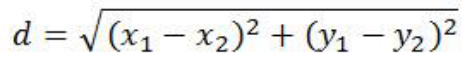
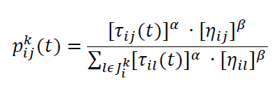

# Logistic Routing Problem


## Tujuan Tugas
1. Review materi pathfinding pada mata kuliah Strategi Algoritma.
2. Mengenal multiple-agent TSP.
3. Melakukan visualisasi data.

## Deskripsi Masalah
Welcome to **Oldenburg** ! Kota kecil cantik ini merupakan sebuah kota kecil di barat lau kota Bremen , Jerman , dengan penduduk kurang lebih 168 ribu jiwa [2018]. Kota kecil ini cocok menjadi lahan uji coba untuk melakukan pemodelan sederhana pembuatan rute pengantaran logistik.<br>
Setiap beberapa jam sekali, sebuah perusahaan logistik akan mengirimkan beberapa kurirnya untuk mengantar barang dari kantor pusat mereka ke beberapa titik tujuan yang tersebar di penjuru kota Oldenburg. Anda diminta untuk mencari rute untuk seluruh kurir sehingga jarak yang ditempuh oleh semua kurir paling kecil, sehingga perusahaan logistik dapat menghemat biaya bensin.

## Multiple-Agent TSP
Masalah pengantaran barang untuk satu kendaraan dengan fungsi objektif jarak minimal dapat dimodelkan oleh Travelling Salesman Problem. Akan tetapi, perusahaan logistik biasanya memiliki lebih dari satu kendaraan yang berangkat bersamaan, sehingga TSP kurang cocok digunakan. Generalisasi TSP untuk beberapa agen adalah **multiple-agent TSP (mTSP)**, dan model masalah ini akan kita gunakan. Pada mTSP, akan terdapat *m* tur yang akan dibangun. Syarat dari semua tur mirip dengan TSP, yaitu bahwa seluruh tur akan kembali ke simpul awal (mewakili kantor pusat) dan setiap tujuan hanya akan dilewati oleh satu tur.

## Pendekatan Permasalahan
Masalah Logistic Routing Problem dibagi menjadi 2 bagian, yaitu:
### Pathfinding
  Pathfinding merupakan teknik penelusuran graf pada graf berbobot yang digunakan untuk mencari rute dengan bobot terpendek dari satu simpul ke simpul lainnya. Dalam penyelesaian Logistic Routing Problem, pathfinding digunakan untuk menelusuri jalan sehingga diperoleh rute dengan jarak tempuh terpendek.
  Setiap kota atau titik dalam suatu daerah direpresentasikan oleh simpul-simpul pada graf. Setiap jalan yang menghubungkan antar kota direpresentasikan oleh sisi(v,w) dengan v adalah simpul asal dan w adalah simpul tujuan. Setiap jalan tentu memiliki jaraknya masing-masing sehingga setiap sisi(v,w) memiliki bobot bernilai jarak tersebut.
  Pendekatan pathfinding yang digunakan adalah algoritma A*. Algoritma A* adalah algoritma heuristik yang populer digunakan dalam menelusuri graf sehingga diperoleh rute terpendek. Algoritma A* memiliki formula umum sebagai berikut.
  ```
  f(n) = g(n) + h(n)
  ```
  Dalam kasus Logistic Routing Problem, setiap komponen tersebut memiliki makna sebagai berikut.
  f(n) = cost total untuk mencapai simpul tujuan melalui simpul n
  g(n) = jarak tempuh yang sudah ditempuh dari simpul asal ke simpul n
  h(n) = nilai heuristik berdasarkan jarak garis lurus antara simpul n ke simpul tujuan

  Nilai heuristik h(n) dikatakan feasible apabila jarak garis lurus antara simpul n ke simpul tujuan tidak melebihi jarak perjalanan simpul n ke simpul tujuan yang sebenarnya. Secara umum, nilai heuristik h(n) dapat dihitung dengan formula sebagai berikut.
  ```
  
  ```
  Keterangan:
  x1 = posisi horizontal x dari titik asal pada koordinat kartesius
  x2 = posisi horizontal x dari titik tujuan pada koordinat kartesius
  y1 = posisi vertikal y dari titik asal pada koordinat kartesius
  y2 = posisi vertikal y dari titik tujuan pada koordinat kartesius
  
  Nilai f(n) ini akan menjadi pertimbangan dalam memilih simpul-simpul selanjutnya dalam penelusuran graf. Dengan demikian, penelusuran graf bisa berjalan lebih cepat dalam mencapai simpul tujuan.

### Multiple Traveling Salesperson Problem
  Seperti yang sudah disebutkan di atas, Multiple Traveling Salesperson Problem merupakan permasalahan yang serupa dengan TSP, namun salesperson yang digunakan lebih dari 1 salesperson atau m salesperson. Dari pengertian disebut, maka keluaran yang diharapkan dari permasalahan ini adalah m tur dengan bobot total terkecil. Pendekatan permasalahan dimulai dengan menentukan teknik TSP terlebih dahulu. Pada project ini, teknik TSP yang digunakan adalah **Ant-Colony Optimization**.

  Ant-Colony Optimization merupakan salah satu algoritma meta-heuristic yang juga merupakan bagian dari Swarm-Intelligence. Algoritma ini merupakan algoritma yang prinsip kerjanya terinspirasi dari perilaku makhluk hidup, yaitu semut. Perilaku semut yang menjadi inspirasi untuk algoritma ini adalah perilaku semut dalam mencari makanan. Semut tidak dapat berkomunikasi secara langsung. Semut berkomunikasi melalui pheromone yang didepositkan oleh semut-semut sebelumnya. Apabila suatu jalan memiliki kandungan pheromone yang besar, maka semut akan cenderung memilih jalan tersebut. Berikut ini adalah ilustrasi alur kerja Ant-Colony Optimization.
  1. Di awal pencarian makanan, semut-semut akan berjalan secara acak melalui path tertentu untuk mencapai sumber makanan.
  2. Dalam perjalanan setiap semut, mereka akan mengeluarkan zat pheromone dalam perjalanannya sehingga dapat diikuti oleh semut lainnya.
  3. Setelah semut mencapai sumber makanan, semut akan memilih rute secara acak kembali melalui path tertentu.
  4. Bila semut sampai ke tempat asal lebih awal, semut-semut lainnya akan cenderung memilih jalan dengan pheromone terbanyak, yaitu jalan dengan path terkecil.
  5. Ketika pencarian makanan sudah melibatkan semut yang sangat banyak, maka kecenderungan memilih tersebut akan semakin tinggi hingga hampir setiap semut memilih jalan yang sama.

  Kecenderungan memilih jalan dengan pheromone terbanyak dapat direpresentasikan sebagai probabilitas dalam memilih jalan. Setiap kembalinya semut, maka terdapat zat pheromone yang ditinggalkan yang dapat mengalami evaporasi. Semakin sering suatu jalan dipilih, maka zat pheromone pada jalan tersebut semakin tinggi. Begitupula sebaliknya. Akhirnya, probabilitas pemilihan bergantung pada jarak tempuh suatu rute. Algoritma ini diterapkan dalam penyelesaian Travelling Salesperson problem.

  

### Teknik mTSP yang diterapkan
  Penyelesaian mTSP dilakukan dengan membagi m salesperson ke dalam m tur sedemikian rupa sehingga diperoleh bobot total sedikit mungkin. Pendekatan yang digunakan dalam penyelesaian mTSP adalah dengan membagi daerah-daerah tur untuk setiap salesman yang tersedia. Bila terdapat m salesman, maka terdapat m pembagian daerah. Pembagian daerah ini didasarkan pada posisi dan koordinat setiap titik atau kota. Mengingat Logistic Routing Problem menyediakan informasi koordinat, maka kita bisa memanfaatkan koordinat-koordinat tersebut sebagai teknik pembagian daerah mTSP.

  Secara sederhana, penentuan m daerah untuk m salesperson dilakukan sebagai berikut.
  1. Tentukan terlebih dahulu depot-depot atau stasiun logistik yang akan digunakan.
  2. Tentukan depot pusat yang digunakan sebagai depot awal dan akhir.
  2. Depot-depot tersebut akan dimasukkan dalam sebuah senarai yang berisi ID setiap depot.
  3. Lakukan pengurutan senarai sedemikian rupa berdasarkan koordinat masing-masing depot sehingga senarai memiliki koordinat-koordinat yang terurut membesar.
  4. Hapus depot pusat dari senarai tersebut.
  5. Karena senarai sudah terurut, lakukan pembagian per m depot dalam senarai tersebut. Bila hasil pembagian depot tidak bulat, depot yang tersisa akan dimasukkan pada sub-array awal atau akhir.
  6. Lakukan penambahan depot pusat pada setiap sub-array untuk menjamin bahwa tur dimulai dan berakhir pada depot pusat.
  7. Setiap sub-array ke-i akan menjadi tur TSP untuk salesperson ke-i

## Getting Started
Instruksi-instruksi berikut ini akan membimbing Anda dalam tahap instalasi aplikasi dan cara menjalankannya.

### Prerequisites
Berikut ini adalah persiapan environment yang dibutuhkan untuk menjalankan aplikasi.
```
- Python 3.x.x untuk bahasa pemrograman aplikasi
- Matplotlib Library untuk visualisasi peta
- GraphViz Library untuk visualisasi graf sederhana
```

### Installing
Berikut ini adalah langkah-langkah dalam penginstallan aplikasi:
1. Install library Matplotlib terlebih dahulu menggunakan command sebagai berikut.
```
pip install matplotlib
```
2. Install library GraphViz terlebih dahulu menggunakan command sebagai berikut.
```
pip install graphviz
```
3. Semua prerequisites sudah disiapkan dengan baik.

## How to Run Program
Untuk menjalankan program, pastikan command sudah berada dalam directory `./src`, lalu jalankan command sebagai berikut.
```
python mtsp.py
```

## Guideline: How to Use
1. Masukkan nama file yang berisi daftar koordinat setiap kota. Untuk setiap koordinat kota, digunakan format berupa 
```
ID XPosition YPosition
```
Berikut ini adalah contoh daftar koordinat kota pada FileNode.txt
```
1 200 300
2 300 400
3 100 50
```
2. Masukkan nama file untuk setiap sisi atau jalan yang menghubungkan antar kota.
```
IDEdge IDAsal IDTujuan Jarak
```
Berikut ini adalah contoh daftar jalan penghubung antar kota pada FileEdge.txt
```
1 1 2 80
2 1 3 200
3 2 3 150
```
Pastikan bahwa setiap jalan pada FileEdge.txt menghubungkan kota-kota yang bersesuaian dengan daftar kota pada FileNode.txt

3. Masukkan jumlah salesman yang diinginkan. Pastikan jumlah salesman tidak melebihi banyaknya kota.
4. Masukkan kota asal (origin city).
5. Aplikasi akan memproses masukkan pengguna untuk diolah menjadi kumpulan rute terpendek.
6. Aplikasi akan menampilkan visualisasi peta dan rute-rute yang dilewati oleh setiap salesman.

## Checklist Milestone Pengerjaan
- [X] Milestone 1 : Pembacaan File dan Representasi Graf dalam Matrix
- [X] Milestone 2 : Mengembalikan Solusi Multiple TSP
- [X] Milestone 3 : Visualisasi Rute olusi Multiple TSP

## Built With
* [Python](https://www.python.org/) - Back End dari Aplikasi

## Referensi Awal Pengerjaan Tugas
Silahkan gunakan referensi berikut sebagai awal pengerjaan tugas:
[1] Dataset : https://www.cs.utah.edu/~lifeifei/SpatialDataset.htm<br>
[2] Pengenalan dan formulasi mTSP : https://neos-guide.org/content/multiple-traveling-salesman-problem-mtsp<br>
[3] MIP , pustaka Python untuk optimisasi : https://python-mip.readthedocs.io/en/latest/intro.html<br>
[4] OpenGL untuk Python : https://stackabuse.com/brief-introduction-to-opengl-in-python-with-pyopengl/<br>
[5]  Li, Feifei, Dihan Cheng, Marios Hadjieleftheriou, George Kollios, and Shang-Hua Teng. "On trip planning queries in spatial databases." In International symposium on spatial and temporal databases, pp. 273-290. Springer, Berlin, Heidelberg, 2005.

## Referensi Formulasi Multiple TSP
[1] Solving Multiple TSP Problem by K-Means and Crossover based Modified ACO Algorithm : https://www.ijert.org/research/solving-multiple-tsp-problem-by-k-means-and-crossover-based-modified-aco-algorithm-IJERTV5IS020474.pdf<br>
[2] Vehicle Routing Problem : https://developers.google.com/optimization/routing/vrp<br>
[3] Amazing Collection Vehicle Routing Problem : https://github.com/ashishpatel26/Amazing-Collection-Vehicle-Routing-Problem<br>
[4] Vehicle Routing Problem : https://github.com/jwang0306/vehicle-routing-problem<br>
[5] An Ant Colony Optimization Algorithm for Multiple Travelling Salesman Problem : https://www2.cs.siu.edu/~rahimi/shared/TSM/01691778.pdf<br>
[6] Dijkstra Algorithm for Pathfinding : https://informatika.stei.itb.ac.id/~rinaldi.munir/Stmik/2019-2020/Algoritma-Greedy-(2020).pdf<br>
[7] A* Algorithm for Pathfinding : https://www.annytab.com/a-star-search-algorithm-in-python/

## Credits
Thank you for Li Fei Fei et. al. for providing the data.

## Catatan
Pencarian rute untuk setiap agen mungkin tidak menghasilkan solusi atau rute yang optimal mengingat pembagian tugas kota-kota dilakukan secara acak.

## Author
**13518056 - Michael Hans** - *Designer, Programmer, and Tester*

## Acknowledgements
* Asisten IRK, Nur Alam Hasabie